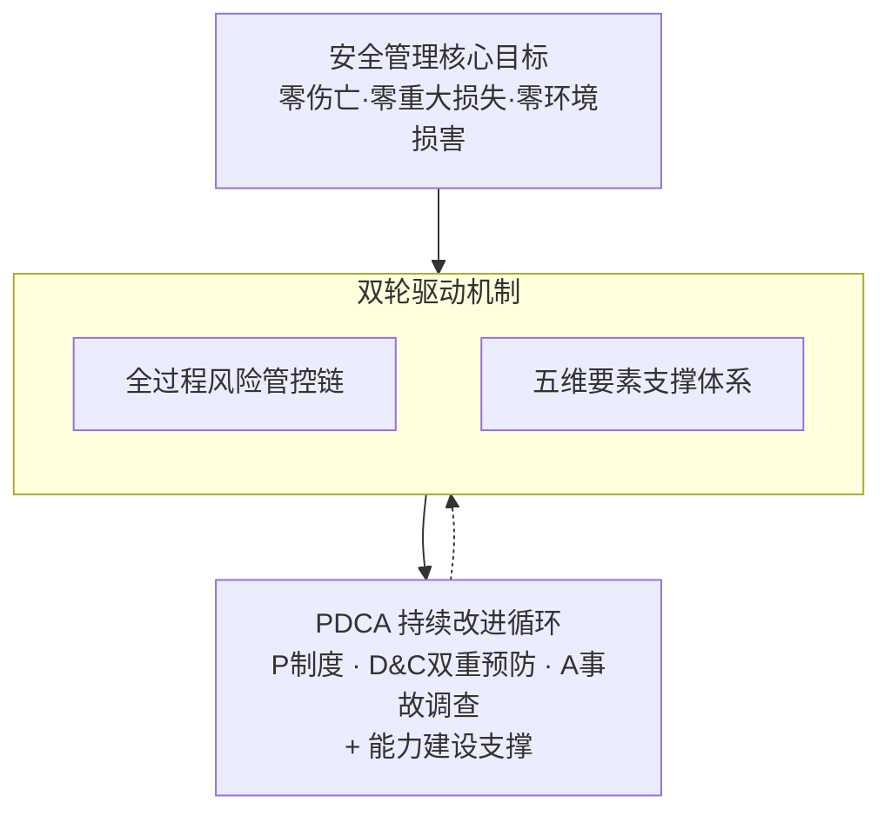
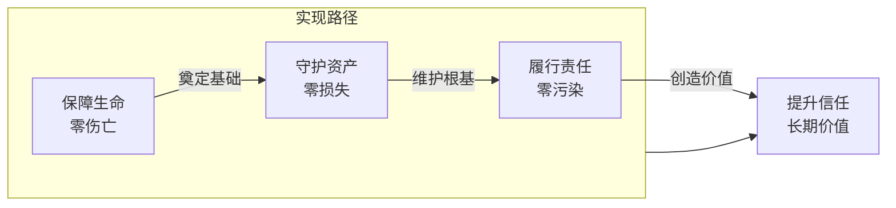
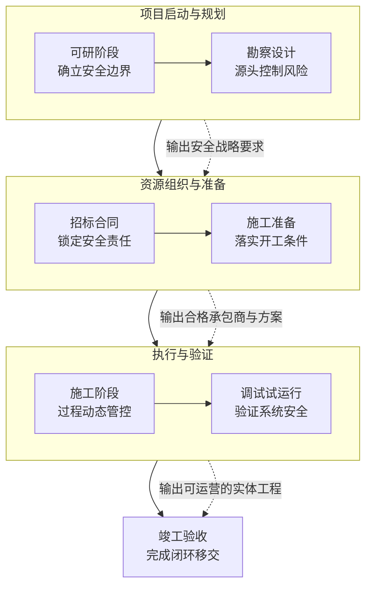
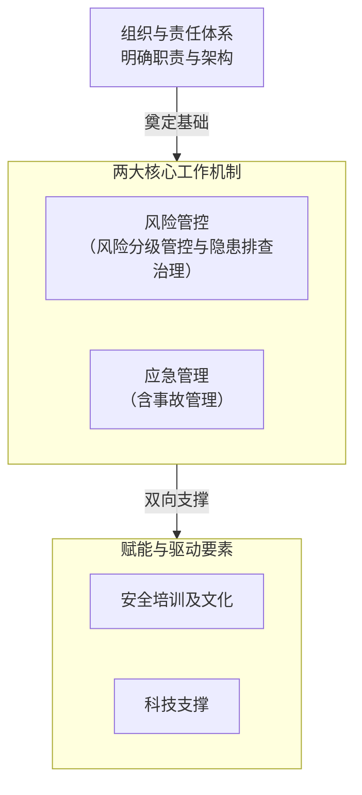
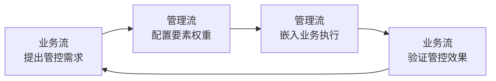
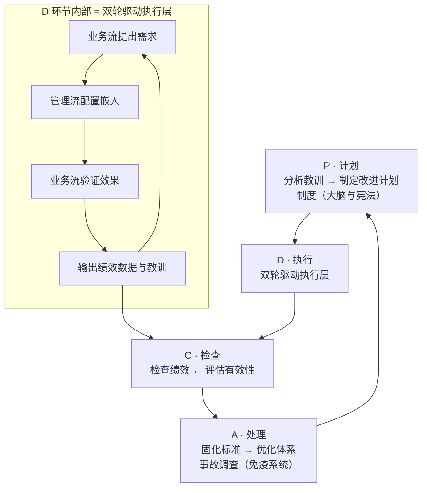

# 工程安全管理体系 —— 从战略设计到落地执行

> 这是一份关于"怎么系统性地管好工程安全"的白皮书。写给决策层看的——不绕弯子，不讲概念，只讲清楚三件事：体系为什么这么设计、核心架构是什么、怎么落地。附录里有七阶段管控要点、五要素深度拆解和 PDCA 实操映射，需要深挖的可以翻过去看。

---

## 前言

工程安全管理真正的困境在哪？不是检查不够多，也不是制度不够严——而是压根儿没一套系统性的体系。安全管理被拆散在项目各个阶段、各个环节里，管一段漏一段，出了事才手忙脚乱，换个项目经理一切归零。

这套体系想回答一个问题：**一个组织怎么系统性地管好工程安全——不靠某个能人撑场面，而是靠一套可复制、能进化的体系？**

答案浓缩成四句话：跟着工程全过程走，按五要素管，靠 PDCA 改，让专业的人驱动。接下来，从真问题说起，把这套体系的全部设计逻辑一层层展开。

---

## 诊断篇：安全管理为什么需要一套体系？

### 第1章 · 四个真问题

聊体系之前，得先面对四个扎心的问题。这四个问题不是哪个项目或哪个人的锅——它们是"没有体系"的必然结果。

**碎片化：管一段漏一段。** 安全管理分散在可研、设计、招标、施工、调试、竣工各个阶段，但各阶段之间各管各的。可研阶段发现的风险，传到设计阶段就断了线；施工准备阶段的交底，到了施工阶段早被抛到脑后。为什么？因为安全管理从来没被嵌入到工程本身的节奏里。工程有自己的客观规律——可研做得不到位，设计就是拍脑袋；设计留下坑，施工阶段再折腾也只是填坑。可安全管理一直被当成每个阶段的"附加题"而不是"必答题"，管一段漏一段，不奇怪。

**被动式：出了事才管。** 现在大部分精力花在哪？花在事后处置和追责上。事前预防？投入少得可怜。这不是态度问题，是机制问题。没有一套系统性的风险识别和隐患排查闭环，管理者根本不知道哪里会出事，只能等出了事再救火。这种"救火式"管理，把组织的安全资源耗得干干净净，系统性风险却一点没降下来。

**两张皮：各说各话。** 安全团队和工程团队，日常就像两条平行线——安全管安全的，工程管工程的。安全要求纸面上写得清清楚楚，一到现场就落不下去；工程按自己的节奏推，安全什么时候介入、怎么介入，没有任何机制保障。说到底，缺少一个让管理流嵌入业务流的机制——让安全跟工程不再"各说各话"。

**不可复制：人走茶凉。** 一个项目的安全搞得怎么样，全看项目经理或安全主管的个人水平。人走了，项目一换，那套隐形的"经验体系"也跟着走了。没有显性化的框架、标准化的流程、持续积累的知识库，安全水平永远像过山车，成不了组织级的稳定能力。

这四个问题不是孤立存在的。它们是一条因果链：碎片化催生被动式，被动式加剧两张皮，三个问题叠在一起，结果就是不可复制。指向同一个判断：**工程安全管理缺的不是更多检查、更多罚款——缺的是一套系统性的体系。**

---

### 第2章 · 重新理解安全管理的价值

聊"怎么做"之前，先搞清楚一个前提：安全管理到底是什么？这个答案决定了整个体系的设计起点。

**从"成本中心"到"战略资产"。** 长久以来，安全管理在工程领域被默认为"花钱的事"——投安全经费、配安全人员、应付检查，都是为了"不出事"。如果不出事，这笔钱似乎"白花了"；如果出了事，又觉得"花得不够"。在这种认知下，安全管理天然就是被动和边缘的角色。

但换个角度看看：安全管理本质上做的是风险经营。一个工程项目的投资回报率，取决于三个变量——投资规模、运营收益、风险折损。安全管理的核心功能，就是控制"风险折损"这个变量：避免事故造成的直接经济损失、工期延误和保险成本上升。说白了，安全管理的产出不是抽象的"平安"，而是可度量的投资回报保障。

《安全生产法》第四条要求生产经营单位"加强安全生产管理，建立健全全员安全生产责任制和安全生产规章制度"，这本质上就是要求安全管理从碎片化走向体系化、从被动合规走向主动创造价值。

**三大核心价值。** 把安全管理放在项目投资回报的框架里看，它创造的价值分三个层次：

**经济效益价值**最直接。系统性安全管控能避免高处坠落、基坑坍塌这类典型事故的直接损失，保障工期不因安全事故中断。加上良好的安全记录可以争取工程险的优惠费率——一套体系跑下来，全生命周期成本结构是能算得出账的。

**风险管理价值**更深一层。可研阶段的安全预评价为投资决策提供安全论证依据，标准化的承包商准入机制能降低分包履约风险，针对深基坑、有限空间这类重大技术风险制定专项方案——确保工程推进不受失控风险的威胁。这些不是"额外工作"，是保障投资安全必须做的事。

**品牌与可持续发展价值**最长远。在水务环保工程建设领域，安全记录差的承包商在投标中天然吃亏。安全品牌本身就是差异化竞争优势。把安全管理融入 ESG 战略，更是构建长期竞争力的必经之路。

**核心转变：从事后算损失，到事前算回报。** 安全管理不是"花钱买平安"的成本项，而是保障项目投资回报的战略资产。这个认知转变，是整套体系设计的第一块基石。

---

### 第3章 · 这套体系要回答的核心问题

既然安全管理是战略资产，那接下来的问题就是：怎么系统性地创造这项资产？

这套体系不是一份工作计划，也不是一张检查清单。它是一个组织系统性地管好工程安全的完整答案——从战略目标设定到现场操作执行，从单项目管控到组织能力积累，一条线打通。

它要回答三个核心命题：

**第一，安全怎么跟着业务走？** 工程有自身的客观规律——可研、设计、招标、施工、调试、竣工，阶段不可跳跃，产出环环相扣。安全管理必须嵌入这个全过程，做到"业务走到哪，安全管到哪"。脱离业务节奏，安全管理必然碎片化、两张皮。

**第二，用什么体系手段管？** 光知道每个阶段要管还不够，还需要一套结构化的管理工具——谁负责、怎么防、怎么控、怎么救、怎么让人会干、怎么让系统撑得住。这些就是安全管理的方法论工具箱。

**第三，管完之后怎么越管越好？** 体系不能是静止的。一个项目管完了，经验教训怎么沉淀？下一个项目怎么在更高起点上启动？这需要一个持续改进的机制，让体系自己会进化。

三个命题分别对应三个层次：全过程风险管控链、安全管理五要素、PDCA 持续改进循环。接下来，一个一个拆开看。

---

## 方案篇：三层递进 · 双轮驱动 · 持续改进

### 第4章 · 体系全景：三层递进架构

先看全貌，再拆细节。

这套体系分三层，一层叠一层：

**顶层 —— 目标层：定方向。** "三个零"四级递进目标（零伤亡 → 零损失 → 零污染 → 长期价值），指明安全管理的战略方向。目标不是挂在墙上的口号——目标有多清晰，执行层的设计就有多精准。

**中间 —— 执行层：干起来。** 双轮驱动是这套体系的动力核心。一边是全过程风险管控链（业务流），一边是安全管理五要素（管理流）。业务流定义"做什么事"，管理流提供"怎么管事"。两者不是各干各的，而是管理流嵌进业务流里——这是整个体系最关键的融合关系。

**底层 —— 改进层：保进化。** PDCA 持续改进循环，让体系不是一次性产品，而是能在运行中不断从数据和教训里学习、自我优化。它回答的是决策层最关心的问题：这套体系转起来之后，怎么保证不会"写完就锁柜子里"？

三层的关系是一条递进闭环：**目标引领 → 执行驱动 → 改进提升**。上层给下层指方向，下层向上层反馈绩效。一个自驱动、自优化的管理体系。

---

### 第5章 · 顶层目标：「三个零」四级递进

安全管理目标不是一句"确保安全"就完事了。它得有层级、有递进关系。

**四个目标，四级递进：**

**零伤亡**是底线。人员安全是第一优先级，没什么可商量的。所有安全投入和制度建设，出发点都是这个——连人的安全都保不住，其他一切免谈。

**零损失**是保障。人安全了，还得管住设备和工程实体资产。基坑坍塌、设备损坏、结构失效这类事故，不只是直接经济损失，更可能把工期拖到崩溃。零损失，就是对项目投资效益的直接保护。

**零污染**是责任。作为环保集团背景的工程建设主体，环境安全不是额外要求，是核心责任。施工排放、废弃物处置、生态扰动——这些环境风险必须在安全管理体系里得到系统性管控。

**长期价值**是追求。前三者加在一起——零伤亡、零损失、零污染——就是企业的安全品牌。在水务环保工程领域，安全记录好意味着更高的投标竞争力、更低的保险成本、更强的监管信任度。安全管理从底线合规走向品牌资产，这才是它的完整价值图谱。

四级递进的逻辑：每一级目标的实现，都是下一级目标的前提。没有零伤亡，零损失就没有伦理基础；没有零损失和零污染，长期价值就是空中楼阁。四个目标不是可选项，是一层一层往上垒的战略金字塔。

这套目标层的设计意义不在于"目标喊得多高"，而在于：它为执行层的双轮驱动提供了明确的优先级和取舍依据。资源不够的时候，零伤亡优先于零损失；方案冲突的时候，人员防护措施不能打折。这种优先级不是写在纸上的漂亮话，是嵌在执行层每个决策节点里的底层逻辑。

---

### 第6章 · 为什么是「全过程链 + 五要素」？

方案篇最关键的章节来了。这套体系为什么选这两个东西做双轮？不是拍脑袋，是对真实问题的逻辑回应。

**命题一：安全管理不能脱离业务空转。**

安全管理的对象就是工程活动本身。没有工程，哪来的工程安全？这是常识，但很多管理实践偏偏把它忘了——安全管理被当成一门独立学科，游离在工程节奏之外，自己制定计划、自己搞检查、自己搞培训，却没嵌到业务的实际进程中去。

而工程管理有它不可违背的客观规律。从可研到设计，从招标到施工准备，从施工到调试再到竣工，七个阶段按时间线依次推进，阶段不能跳，产出环环相扣。可研的论证结果是设计的输入条件，设计的方案质量决定了施工准备的起点，施工准备到不到位直接影响施工阶段的安全绩效天花板。这是一条不可逆的因果链。

所以，安全管理要真正有效，就必须嵌进这条链——业务走到哪个阶段，安全管理就跟到哪个阶段；每个阶段有什么风险特征，就配什么样的管控策略。这就是全过程风险管控链的逻辑起点：**安全管理跟着业务走，不脱节。**

**命题二：五要素就是集团管理体系在安全领域的体现。**

光知道"每个阶段都要管"不够——还需要具体的管理手段。安全管理五要素——组织与责任体系、风险管控、应急管理、培训文化、科技支撑——不是新造的概念，是环保集团管理体系在安全领域的结构化呈现。

这五要素可以用"三体"框架来理解：

| 三体 | 对应五要素 | 解决的命题 |
|------|-----------|-----------|
| 体制 | 组织与责任体系 | 谁负责、谁监督、谁执行 |
| 机制 | 风险管控 + 应急管理 | 怎么防、怎么控、怎么救 |
| 能力 | 培训文化 + 科技支撑 | 人会干、系统能撑 |

体制解决"有人管"，机制解决"管得住"，能力解决"管得久"。三体层层支撑，就是一个完整可操作的安全管理方法论。

**命题三：业务 + 管理，缺一不可。**

| 如果只有… | 结果 |
|-----------|------|
| 全过程链，没有五要素 | 知道每个阶段要管，但没手段——安全管理变成口号 |
| 五要素，没有全过程链 | 有一套管理工具，但不知道用在哪——安全管理变成空中楼阁 |
| 两者融合 | 业务流承载管理流、管理流嵌入业务流——安全与工程不再两张皮 |

**打个比方：全过程链是"河"，五要素是"治水"。** 河走到哪，治水跟到哪。但不同河段的水情不一样——上游湍急需要源头防控，中游开阔需要过程管控，下游平缓需要收尾验收。治水策略随河段而变。

光认河不治水是放任——你知道项目到哪个阶段了，但没有手段去管这个阶段的风险。光治水不认河是空转——你有一堆管理工具，但脱离了项目节奏，全是纸上谈兵。两者合一，才是真正的管安全。

---

### 第7章 · 左轮：全过程风险管控链

全过程风险管控链把工程全生命周期切成七个阶段，从项目启动到资产交付，一条线串起来。

**七阶段全景：**

可研 → 勘察设计 → 招标 → 施工准备 → 施工 → 调试试运行 → 竣工验收

七个阶段归成四个功能组：

- **项目启动与规划**（可研 + 勘察设计）：确立安全边界、完成源头风险控制
- **资源组织与准备**（招标 + 施工准备）：锁定安全责任、落实开工条件
- **执行与验证**（施工 + 调试试运行）：过程动态管控、系统安全验证
- **收尾**（竣工验收）：完成合规移交、实现责任闭环

**全过程链的核心逻辑：递进关系。** 七个阶段不是独立的时间切片，而是一条因果链。每个阶段的输出，天然成为下一阶段的输入：

- 可研阶段风险识别不充分、安全专篇有遗漏，设计阶段就做不出精准的源头防控——从一开始就建在错误输入上
- 设计阶段本该靠本质安全设计消除的风险没被消除，这些风险就原封不动进到施工阶段，变成只能用现场管理硬扛的"不得不面对的风险"
- 施工准备如果组织架构没搭好、专项方案审批走过场、人员培训糊弄了事，施工阶段投入再多也只是在填坑

**所以，全过程链本质上干三件事：不跳——每个阶段的安全管控不能省略；不漏——每个阶段的管控对象（输入、任务、输出）都有明确定义；不断——上一阶段的产出无缝传到下一阶段，形成连续的安全管控链条。**

每个阶段的管控逻辑都遵循统一的"输入 → 核心任务 → 输出"结构。七阶段管控要点详见附录 A，这里不展开。

---

### 第8章 · 右轮：安全管理五要素

全过程链解决的是"在什么时候管什么"，五要素解决的是"用什么手段管"。五要素之间不是五个平列的模块，而是一个有层次、有主从关系的结构。

**组织与责任体系 —— 地基。** 整个体系的第一要素。

没有清晰的组织架构和责任归属，所有后续管理动作都没有执行主体。它分三个层面：三位一体架构（总部决策监督 → 项目公司管理主责 → 施工单位执行实施）、五方责任主体（建设/勘察/设计/施工/监理各司其职）、岗位安全责任清单（责任到人、任务到岗）。《安全生产法》第二十一条规定的生产经营单位主要负责人职责，给这个要素提供了法理基础。

**风险管控 + 应急管理 —— 核心引擎。** 这两个要素构成安全管理最核心的运转机制。

风险管控依托双重预防机制运行。第一重是风险分级管控——在事前对工程项目的危险源系统辨识、科学评估、合理分级，然后按不同等级配置不同的管控资源。第二重是隐患排查治理——在事中对管控措施的落实情况进行排查，发现问题立刻整改，形成排查→整改→验收→销号的闭环。两个机制之间的动态关系是：风险管控给隐患排查指方向（知道重点查什么），隐患排查的结果反过来验证和修正风险等级（管得对不对、等级要不要调整）。

应急管理是风险失控后的兜底机制。包括预案编制、资源配置、定期演练、响应处置和总结改进五个环节，通过分级响应和重大事故情景构建，确保最坏情况发生时，组织的应对是有准备的、有序的、有效的。

**培训文化 + 科技支撑 —— 赋能放大器。** 这两个要素不直接产生管控效果，但它们决定了核心引擎能跑多快、跑多准。

培训文化解决"人会干"的问题：三级安全教育、专项技能培训、管理层领导力培训分层推进，配合安全意识→安全行为→安全文化生态的递进路径，以及正向激励和标杆引领，确保安全要求从纸面进入人的行为。

科技支撑解决"系统能撑"的问题：危大工程实时监控、人员定位和环境监测等智能手段，安全管理信息系统实现风险→隐患→绩效全链条数据贯通，以及基于数据分析的差异化精准管控——让安全管理从"靠人盯"升级为"靠系统管"。

五要素的逻辑一句话说清楚：**组织与责任打基础，风险管控和应急管理当核心，培训文化和科技支撑做赋能。** 三句话讲明白：有人管、管得住、管得久。

---

### 第9章 · 双轮如何协同？

前两章分别讲了全过程链和五要素各自的设计逻辑。但双轮驱动的精妙之处不在各自完善，而在两者怎么协同。

**核心命题：业务流与管理流的融合。**

全过程链是业务流——定义"做什么事"：项目到了哪个阶段，该完成哪些业务活动。五要素是管理流——提供"怎么管事"：用什么体系手段确保每个业务环节安全可控。

两者的关系不是"流程轴 + 能力轴"的平行叠加，而是**管理流嵌进业务流、业务流承载管理流**。没有业务流，管理流没有对象——安全管理不能脱离项目阶段空转。没有管理流，业务流没有保障——项目推进没法确保安全受控。

如果只是把全过程链和五要素并排放在一起，说"这是我们的两个抓手"，那跟传统的"堆模块"没有任何区别。真正的协同，是在每一个阶段上思考：这个阶段的业务特征是什么？需要五要素中的哪些站出来主导、哪些维持运转？管理动作怎么嵌到业务动作里执行、而不是独立运作？

**四步协同环：**

双轮驱动在每个项目阶段都会跑一个四步循环：

**第一步 —— 业务流提出管控需求。** 项目到某个阶段，该阶段特有的风险类型、参与方、管控对象，自然决定了需要什么样的安全能力。施工准备阶段面对的是从纸面到现场的转换，管控需求集中在组织建立、方案审批、交底落实和入场培训上。施工阶段面对的是每天都在变化的现场作业环境，管控需求转向日常巡检、危大工程盯防和应急响应准备。

**第二步 —— 管理流配置要素权重。** 根据第一步的需求，决定五要素的主从格局。同一要素在不同阶段的角色完全不同：组织与责任在可研和招标阶段是"地基"，到施工阶段退为日常运维；风险管控几乎逐阶段主导，但从战略识别递变到操作检查、再到功能验证；应急管理在施工准备和施工阶段上升为主导；培训文化在人员入场和作业高峰期集中发力；科技支撑在现场监控和收尾归档时成为主导。

**第三步 —— 管理流嵌入业务执行。** 要素不是独立运行的，而是嵌进业务动作——风险管控嵌入设计阶段的 HAZOP 分析和施工阶段的日常巡检，应急管理嵌入施工准备的资源调配和施工阶段的定期演练，培训文化嵌入安全交底和班组晨会。要素在业务行动中实现，不是在业务之外另搞一套。

**第四步 —— 业务流验证管控效果。** 每阶段的业务产出本身就是管理流成效的检验。可研安全专篇论证是否充分？施工准备专项方案是否审批通过？施工阶段安全绩效是否达标？不达标就触发修正循环。

**关键洞察：管理流不是均匀涂抹的，权重随阶段动态调整。**

下表展示安全管理五要素在七个阶段的主导/从属分布。● 表示主导要素（承担本阶段主要推动作用），○ 表示从属要素（维持性运转）。

| 阶段    | 组织与责任 | 风险管控 | 应急管理 | 培训文化 | 科技支撑 |
| ----- | :---: | :--: | :--: | :--: | :--: |
| 可研    |   ●   |  ●   |  ○   |  ○   |  ○   |
| 勘察设计  |   ○   |  ●   |  ○   |  ○   |  ○   |
| 招标    |   ●   |  ○   |  ○   |  ○   |  ○   |
| 施工准备  |   ●   |  ●   |  ●   |  ●   |  ○   |
| 施工    |   ○   |  ●   |  ●   |  ●   |  ●   |
| 调试试运行 |   ●   |  ●   |  ●   |  ○   |  ○   |
| 竣工验收  |   ●   |  ○   |  ○   |  ○   |  ●   |

**规律一：风险管控是"常驻主角"，但形态随阶段递变。**

风险管控几乎每个阶段都是主导，但管控形态完全不同：

| 阶段    | 风险管控形态                              |
| ----- | ----------------------------------- |
| 可研    | 战略识别——回答"能不能干、风险多大"               |
| 勘察设计  | 技术量化——通过 HAZOP/LOPA 等工具把风险转化成设计参数 |
| 施工准备  | 方案审批——把风险管控措施细化到专项施工方案            |
| 施工    | 操作检查——通过日常巡检和危大工程盯防确保措施落地         |
| 调试试运行 | 功能验证——检验安全系统的实际运行效果               |

同一个要素，在不同阶段完全是不同的管法。因为业务流改变了风险的性质——从纸面判断到技术设计、再到现场操作——管理手段必须跟着变。

**规律二：管理密度呈"哑铃型"分布。**

施工准备和施工阶段是主导要素最密集的时期：
- 施工准备：四个要素同时主导（组织与责任、风险管控、应急管理、培训文化）
- 施工阶段：四个要素同时主导（风险管控、应急管理、培训文化、科技支撑）

两端的可研和竣工阶段，主导要素收缩到两三个。这是业务风险特征的直接反映：从纸面方案到现场执行，不确定性最大、事故风险最高，管理流必须在这集结最大力量。

**规律三：组织与责任在关键决策点必然切入。**

组织与责任要素在五个关键节点上处于主导：可研（论证决策）、招标（合同签约）、施工准备（建组织架构）、调试（责任移交验证）、竣工（正式移交）。这五个节点恰好是安全管理中"责任边界"需要被重新定义或确认的时刻——组织与责任必须在这些节点上站出来，确保"谁负责"在每个转折点都被重新确认。

---

### 第10章 · 底层：PDCA 持续改进循环 —— 体系如何自我进化？

体系能不能自我进化，是决策层最需要关注的问题。一个静态的体系写得再好，运行一年后外部环境变了、项目类型变了、事故教训没被吸收，体系的效力就会逐月衰减。

PDCA 就是为解决这个问题设计的。它不是抽象的四步循环，每个环节在体系中都有具体的落点。

**P · 计划 —— 制度（大脑与宪法）。** 为所有模块提供规则、标准和依据。没有制度，其他工作无章可循。而且制度不是写完就放着的——PDCA 循环定期检验制度的有效性，发现不合适的就改。

**D & C · 执行与检查 —— 双重预防（心脏与双引擎）。** 这是 PDCA 中最活跃、最日常的部分。风险管控是"导航系统"——告诉你该管哪里、重点管什么；隐患排查是"扫描系统"——发现路障、清除路障。两者形成动态循环：风险给排查指方向，排查结果反过来修正风险等级。

**A · 处理 —— 事故调查（免疫系统与进化引擎）。** 这是 PDCA 中最容易被忽视却最重要的环节。对事故和未遂事件的深度剖析，是对前面所有模块的逆向检验：制度有没有漏洞？风险识别有没有遗漏？隐患排查有没有走过场？培训有没有失效？调查结论反馈到制度层面优化规则、到风险隐患层面更新数据库、到培训层面改进课程——这才形成真正的闭环进化。

**能力支撑 —— 培训 + 专家 + 重点辅导 + 标杆创建（肌肉与血液）。** PDCA 四个环节的运转，需要组织安全执行力的支撑。培训解决"人会干"，专家队伍解决"难题有人解"，重点辅导解决"短板不拖后腿"，标杆创建解决"怎么做才是最好的"。四个模块共同维持体系的运转能力。

**核心逻辑链：（制度是基础 → 风险与隐患管控是核心 → 事故调查是闭环）+ 能力建设是支撑。（确保体系能从错误中学习并进化。）**

**PDCA 四模块与五要素的映射关系：**

| PDCA 模块 | 对应五要素 | 说明 |
|-----------|-----------|------|
| P · 制度 | 五要素共同的规则底座 | 制度不限于单一要素，而是五要素共用的运行规则 |
| D＆C · 双重预防 | 风险管控 | 把双重预防机制放在 PDCA 最活跃的执行位置 |
| A · 事故调查 | 应急管理 | 事故调查是应急管理"总结改进"环节的深化 |
| 能力支撑 | 培训文化 + 科技支撑 | 培训文化与科技支撑贯穿 PDCA 四个环节提供持续能力 |

**三层闭环：PDCA 与双轮驱动的层级关系。**

PDCA 和双轮驱动不在同一层。PDCA 是上层循环——管"方向对不对、要不要改"，一个周期可能跨越整个项目甚至多个项目。双轮驱动是下层循环——管"在这个方向上怎么做到位"，每个项目阶段走完一圈。

两层通过绩效数据衔接。双轮驱动在每个周期结束时输出绩效数据和教训 → PDCA 的 C（检查）环节接收这些数据 → A（处理）环节把教训固化为标准 → P（计划）环节设定下一轮改进目标 → D（执行）环节启动下一轮双轮驱动。

**一句话：PDCA 管方向，双轮管执行。方向对了执行才有意义，执行到位了改进才有依据。**

---

## 行动篇：从纸面到日常

体系框架讲完了。接下来是决策层最关心的问题：怎么落地？

### 第11章 · 谁来驱动？—— 安全经理的四维能力

体系再完善，没有对的人就转不起来。这套体系对安全经理的要求，不是"更懂检查"，而是具备从技术到领导力的完整能力栈。

四个维度不是平行关系，是一条递进链：

**安全技术 —— 筑基。** 风险识别、标准制定、技术防控，保障本质安全。没有技术根基，安全管理就是在流沙上盖房子。

**安全管理 —— 驱动。** 体系构建、过程管控、应急处置，驱动执行效能。有了技术底子，才能建体系、推落地、应突发。

**安全合规 —— 护航。** 法规遵从、标准执行、责任落实，控制法律风险。合规不是目标，但合规是硬边界。在合规的框架内，管理和技术才能放开手脚。

**安全领导力 —— 破壁。** 安全意识、团队赋能、生态协同，构建安全文化。安全不是安全部门一家的事，安全经理得跨越部门壁垒，让安全理念渗透到组织的每个角落。

四个维度不是各干各的，而是一条递进链：**技术筑基 → 管理驱动 → 合规护航 → 领导力破壁。** 缺一个，体系就转不顺畅。

---

### 第12章 · 怎么做？—— 七阶段实施路径全覆盖

只有顶层框架还不够。从可研到竣工验收，每个项目阶段都已经产出了配套的实施路径文件。这套路径不是"有就行"，而是经过系统设计的——每个文件都遵循统一的结构，彼此之间有完整的因果链。

**每条路径文件的统一结构。** 七个阶段的实施路径文件骨架是一样的：**管控目标**——这个阶段要解决什么安全问题；**核心工作任务拆解**——必须完成的管控动作和步骤；**关键输出成果清单**——产出什么、交给下一阶段；**责任主体明确**——谁对结果负责。这个统一结构是有意设计的——确保每条路径都能回答同一个问题："这个阶段管什么、怎么管、谁来管、产出什么"。有了这个结构，安全管控不再是每个项目自己摸索的经验主义，而是"拿到路径文件就知道怎么干"的标准化操作。换项目不换路径，换人不换逻辑。

**七阶段路径。** 每个阶段的核心定位如下：

**可研阶段——源头规避颠覆性风险。** 核心命题是"能不能干、风险多大"。围绕合法性、技术可靠性、经济合理性三大支柱展开论证，输出《可行性研究报告》安全专篇和《初步重大风险源清单》，从源头上框定安全边界。→ 参见 [[111 可研阶段安全管理实施路径]]

**勘察设计阶段——在图纸上消灭风险。** 设计阶段是本质安全的主战场——图纸上消灭一个风险，比施工阶段控制十个风险更有效、更经济。通过 HAZOP/LOPA 等工具完成风险量化评估，用本质安全设计原则（最小化、替代、缓和、简化）优化方案，输出《HSE 设计专篇》和《安全设施设计说明书》，让安全措施在图纸上固化、在预算中落地。→ 参见 [[112 勘察设计阶段安全管理实施路径]]

**招标阶段——用契约锁定安全责任。** 安全管理从招标开始。"设门槛→评方案→定契约"三步走——资格预审筛掉安全能力不合格的承包商，技术标评审评估安全方案可行性，合同附件锁定安全费用和责任条款。法律约束力，从此成为安全管理的第一道保障。→ 参见 [[113 招标阶段安全管理实施路径]]

**施工准备阶段——从纸面到现场的桥接。** 覆盖组建安全管理组织架构、施工图审查与设计交底、专项方案编制审批、人员培训教育、现场安全设施准备、应急救援准备、开工前安全条件确认——七步全链条，确保项目开工前就具备完善的安全管理体系、合格的施工队伍和有效的应急机制。→ 参见 [[114 施工前准备阶段安全管理实施路径]]

**施工阶段——让管控跟上每天变化的现场。** 施工现场每天都在变——新工作面打开、新队伍进场、新设备投入使用。日常巡检、危大工程全过程监控、危险作业许可管理、隐患排查闭环、应急响应和文明施工管理，形成"日巡检→周排查→考核改进"的高频度管控节拍。周期最长、要素投入最密集，七条路径里内容最厚重的一条。→ 参见 [[115 施工阶段安全管理实施路径]]

**调试和试运行阶段——验证系统的真实安全状态。** 调试是风险形态从静态安装转向动态运行的关键时刻。按"单机调试→系统联动→带负荷试运行"分级分步推进，每个子阶段开始前完成安全条件确认（PSSR），结束后完成问题整改闭环，确保在安全状态明确的前提下完成建设方向运营方的责任移交。→ 参见 [[116 调试和试运行阶段安全管理实施路径]]

**竣工验收阶段——合法合规的闭环移交。** 项目收尾不是安全的终点。"内部预验收→政府专项验收→竣工验收备案→建运交接"四部曲推进。安全设施、消防、环保、档案四大专项逐项验收通过后，签署《安全责任移交协议》，完成正式的安全责任转移。→ 参见 [[117 竣工验收阶段安全管理实施路径]]

**七阶段路径总览。**

| 阶段 | 路径文件 | 核心定位 | 管控逻辑 | 步骤数 |
|------|---------|---------|---------|-------|
| 可研 | 111 | 源头规避颠覆性风险 | 合法性+技术+经济三维论证 | 6 |
| 勘察设计 | 112 | 在图纸上消灭风险 | 风险量化→本质安全设计 | 6 |
| 招标 | 113 | 用契约锁定安全责任 | 设门槛→评方案→定契约 | 6 |
| 施工准备 | 114 | 从纸面到现场的桥接 | 组织→方案→人员→设施→应急→条件确认 | 7 |
| 施工 | 115 | 管控跟上每天变化的现场 | 巡检→危大管控→排查→应急→考核 | 8 |
| 调试和试运行 | 116 | 验证系统的真实安全状态 | 单机→联动→带负荷三级推进 | 8 |
| 竣工验收 | 117 | 合法合规的闭环移交 | 内验→专验→备案→移交 | 8 |

不用把上表背下来。需要记住的是：这条链的每一环都不是独立存在的。可研的安全专篇是设计的输入条件，设计的风险清单是招标的安全要求来源，招标的合同条件决定了施工准备的资源保障，施工准备的专项方案是施工阶段的作业依据，施工阶段的输出决定了调试的起点条件，调试的合格结论是竣工验收的前提。**前一环的输出质量，决定后一环的工作起点。**

这就是第7章说的"不跳、不漏、不断"在操作层面上的体现。体系从战略层贯通到了操作层——任何一个阶段拿出来，都知道"管什么、怎么管、谁来管、产出什么"。决策层不需要关注每个阶段的操作细节，但需要知道：这个体系下面"有路"，不是只有框架没有腿。

---

### 第13章 · 体系落地的四梁

前面讲了体系框架、驱动它的人和落地路径。到这，决策层会本能地问：这套体系跑着跑着会不会散架？

任何管理体系在实际运行中都会面临四种死法：**责任模糊**——人人有责变成人人无责；**制度僵死**——写的时候认真、半年后锁柜子；**能力断层**——知道该做什么但做不了；**拍脑袋决策**——安全管理靠经验判断不靠数据。

体系落地的四梁，不是四根并列的柱子，而是针对这四种死法建的四道防线。每一根梁回答一个问题："要是没有它，体系怎么垮？"

**四梁与五要素的关系。** 五要素定义安全管理"管什么"，四梁定义体系落地"怎么不垮"。四梁为五要素的执行提供保障条件，五要素为四梁的运转提供管理内容。组织保障确保组织与责任体系有人执行，制度保障确保风险管控和应急管理有章可循，能力保障确保培训文化有能力落地，技术保障确保科技支撑有数据驱动。四梁不新增管理内容，防止已有的东西在执行中失效。

**第一根梁 · 组织保障 —— 防止责任模糊。**

管理体系最常见的失败不是有人不负责，而是所有人都以为别人在负责。三位一体架构的价值不在于把层级画清楚，而在于每个层级的安全投入和责任产出有明确的对应关系——总部投标准和监督，项目公司投管理和资源，施工单位投执行力和现场管控。岗位安全责任清单把组织层面的责任拆成个人的可考核动作：不是"你要对安全负责"，而是"你在这个阶段、这个岗位，必须完成这三项安全任务"。安全条线垂直监督——业务汇报和职能监督双线并行——是对"人情打折"这个中国式管理顽疾的制度性回应。

这根梁不立住，体系第一天就陷进"人人有责、人人无责"的泥潭。

**第二根梁 · 制度保障 —— 防止制度僵死。**

制度天然会老化。写的时候花了很多心血，运行三个月发现有些条款跟现场脱节了，但没人有动力去修订，制度就从"最有效的管理工具"变成了"最精致的档案文件"。

这根梁的设计核心在于——制度本身是 PDCA 循环管理下的动态产物。五要素对应五套制度规程，每个阶段明确输入→任务→输出→责任人，但不是写完就完了。PDCA 的 C 环节定期检验制度的有效性，A 环节持续修订不适用的地方，P 环节把修订结果纳入新一版制度。制度不是死文件，是 PDCA 每个周期都"被刷新"的活系统。

这根梁不立住，规则体系会在六个月内从"工作的准则"退化成"应付检查的材料"。

**第三根梁 · 能力保障 —— 防止能力断层。**

纸面上的体系再完善，从管理层到一线班组的执行力跟不上，结果就是文件漂亮、现场依旧。能力保障解决的不是"知不知道怎么做"，而是"做不做得好"。

分层培训覆盖从决策层的安全领导力到一线作业人员的操作技能，确保每一层都具备完成安全职责的知识和技能。专家队伍解决另一层问题——深基坑、有限空间、起重吊装这些高风险作业，不是培训能解决的，需要专业技术力量精准介入。重点辅导针对薄弱公司定向赋能，防止一个短板拖累整体。标杆工地创造从实践到标准的正向循环——实物样板→经验提炼→反哺培训→优化制度，让"怎么做才是最好的"从一个理论问题变成一个可参观、可学习的实体。

这根梁不立住，组织保障和制度保障就是空中楼阁——知道谁负责、按什么做，但就是做不到位。

**第四根梁 · 技术保障 —— 防止拍脑袋决策。**

安全管理中有一个经典的认知偏差：感觉安全不等于真的安全。一段时期没出事故，管理者很容易觉得"我们管得还不错"。技术保障的核心功能就是打破这种错觉——用数据代替感觉，用系统代替经验。

安全管理信息系统让风险识别、隐患排查、绩效追踪的数据在全链条上贯通，不再散落在不同部门的不同表格里。智能监测为危大工程提供实时可视化的安全状态感知，让管理者看到的是数据而不是印象。数据驱动的决策分析让安全管理从"哪里出事了就去哪里"的应激反应，升级为"趋势显示这个方向有系统性风险，提前投入资源"的预防模式。

这根梁不立住，前三根梁的效能都会被"凭感觉判断安全状况"侵蚀——你可能以为组织在有效运转，但数据会告诉你实情。

**四根梁的结构关系。**

四根梁不是并列的，更不是叠加的。它们有明确的依赖关系：

- 组织决定了"谁来做"，制度决定了"按什么标准做"——这两根是体系的**结构性支撑**，缺一不可
- 能力决定了"能不能做好"，技术决定了"怎么越做越好"——这两根是体系的**动态性支撑**，让结构不只在纸面上成立，而是在实践中有效运转

更要命的是，四根梁之间不是加法关系（1+1+1+1=4），而是乘法关系。任何一根梁塌了，整个体系的支撑力趋近于零：有组织没制度，管理靠人情；有制度没组织，执行没主体；有组织有制度没能力，文件漂亮现场依旧；前三根都立住了但没技术，管得对不对全凭运气。

决策层不需要记住每根梁下有什么细节。需要记住的是：这套体系在设计时已经考虑过它可能失效的每一种方式，并且把每一种失效方式都变成了一道独立的防线。四根梁都立住了，体系就散不了。

---

## 结语 · 这套体系改变了什么

回到起点。我们讨论的不是怎么把检查做得更勤、罚款开得更多，而是一个根本性的问题：一个组织能不能不靠运气和个人经验，系统性地管好工程安全？

这套体系改变了四件事。

**第一，改变了安全与业务的关系。** 碎片化和两张皮的本质是同一个问题——安全和业务运行在两条平行线上。全过程链切断这两条平行线，把它们拧成一股绳：可研阶段做安全预评价，设计阶段做本质安全防控，施工准备做条件保障，施工阶段做过程管控。不是"先推业务、再补安全"，而是业务走到哪、安全就嵌到哪。"安全跟着业务走"不是口号——全过程链的七个阶段把它变成了结构化的管控动作。

**第二，改变了管安全的方式。** 被动式的根源不是态度问题，是没有系统性的风险预控手段。五要素改变了管安全的方式——不是靠增加检查频次和处罚力度，而是靠风险分级管控做导航、隐患排查治理做扫描、应急管理做兜底、组织责任确保有人管、培训科技确保管得住管得久。从应激反应切换到预防驱动。

**第三，改变了体系的寿命。** 大多数管理体系写出来第一年有效、第二年打折、第三年锁柜子。PDCA 让这套体系有了自我进化的能力——每个事故教训都被逆向检验并反哺制度，每轮绩效数据都被分析并驱动改进。体系不是一次性产品，是持续升级的操作系统。它不会老化，因为被设计成了活的。

**第四，改变了组织的能力归属。** 不可复制的问题，说到底就是能力长在个人身上，人一走就归零。这套体系把安全能力从个人身上剥离，嵌入组织的架构（三位一体）、规则（制度规程）、流程（七阶段路径）和数据（信息系统）之中。从此，体系本身才是那个"最有经验的人"。换人不归零，换项目不归零。

对决策层来说，这套体系最核心的价值不在于"设计完备"，而在于它重新定义了安全投入的性质。一个项目投在安全上的钱，不再是一笔"但愿用不上的保险金"，而是一项可以度量、可以积累、可以传承的组织能力投资。一个项目管好了，它的经验不是一个人的谈资，而是沉淀进制度和数据库、在下个项目启动时能提供更高起点的资产。

跟工程全过程走，按五要素管，靠 PDCA 改，由专业的人驱动。四句话，一个体系，一个答案。