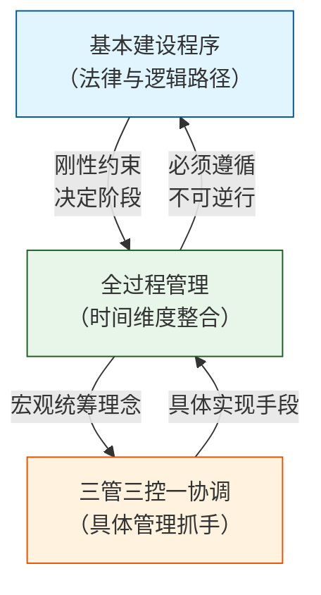
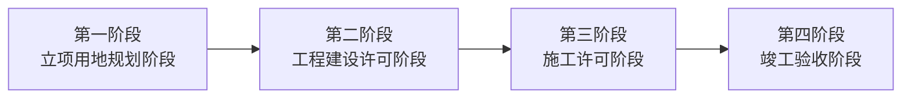
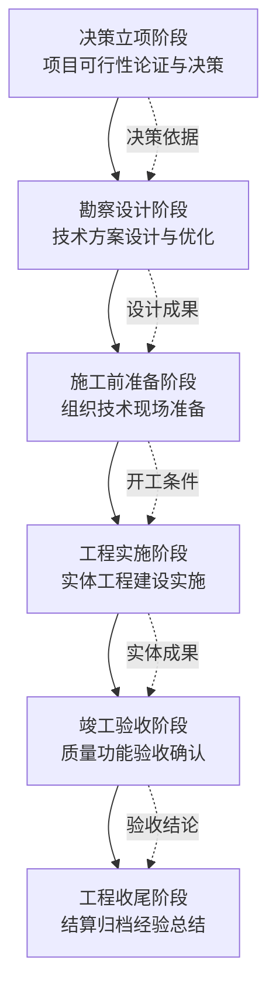
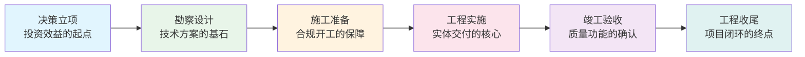
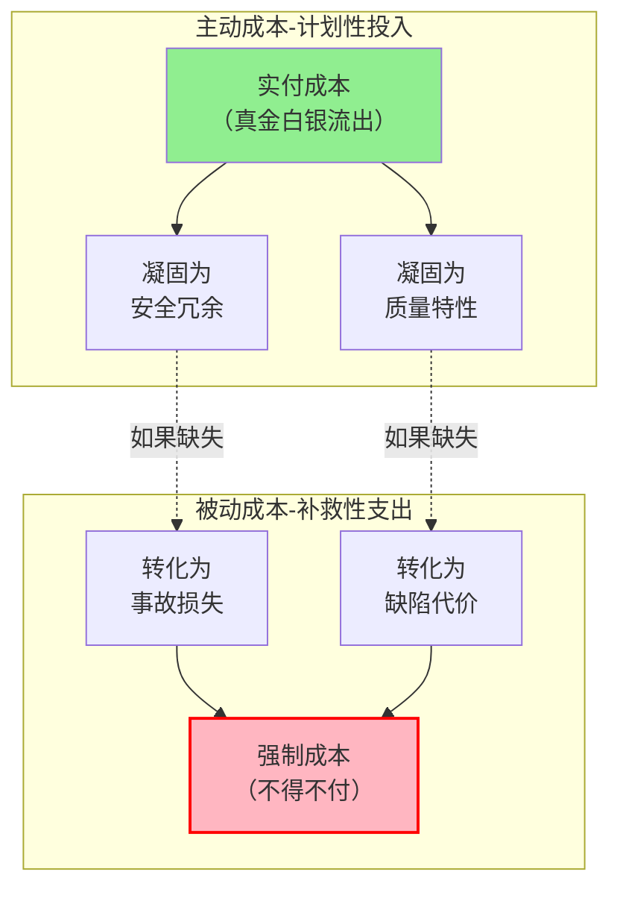
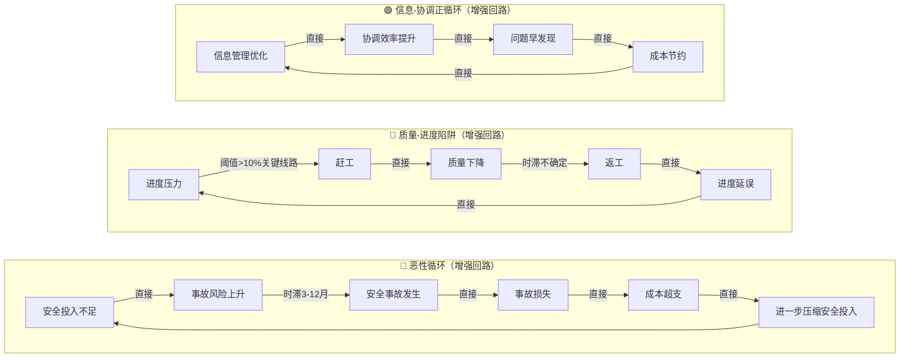
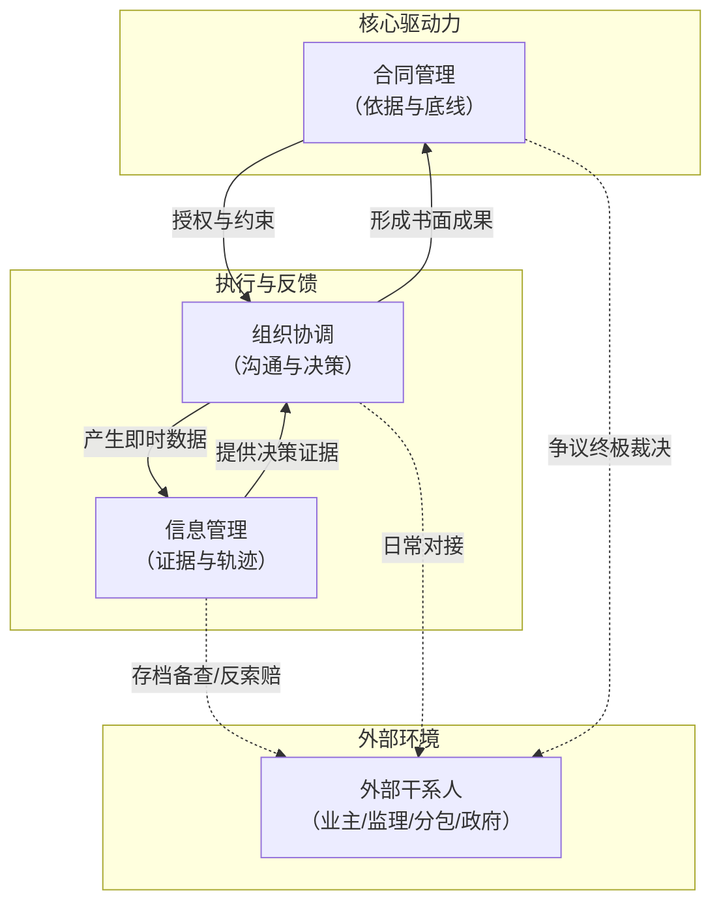
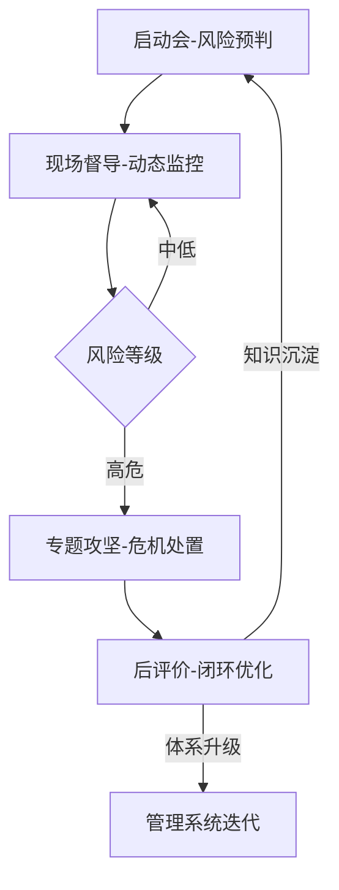
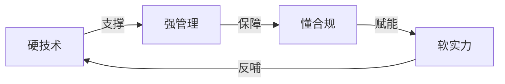

# 工程管理体系与逻辑
## 从"按下葫芦浮起瓢"到系统化管控

> 这篇文章是写给干工程的管理者们看的。不讲大道理，聊聊我们每天都会碰到的那些事，和背后到底缺了什么。

---

## 第一幕：困境——工程管理的"灵魂拷问"

### 引子：一个项目经理的日常

早上8点，某市东区排水管网改造工程的项目经理老张刚走进办公室，电话就响了。

"张经理，3号井位的进度又滞后了，分包说缺人，但人来了就得加钱。"

他还没来得及回话，安全员推门进来："昨晚大雨，5号工作井有渗水迹象，需要立即处理，否则有塌方风险。"

紧接着，业主的电话来了："老张，上次的变更签证什么时候能给我？监理说你们资料不全，没法签字。"

下午，成本会计的报告显示：这个月已经超预算8%，按这个趋势，到月底要超15%。

老张瘫在椅子上，脑子里冒出一句话——**工程管理，就是按下葫芦浮起瓢**。

这个场景，熟悉吗？

进度、质量、成本、安全、合同、信息、协调——七件事像七个球，在空中抛接，接住这个，掉了那个。为什么工程管理总是这样？是管理方法不对，还是这本来就是个"不可能三角"？

这三个问题，一个一个拆开看。

### 灵魂拷问一：进度、质量、成本——为什么不能兼得？

回到老张的项目。进度滞后，怎么办？最直接的办法——赶工。

增加人力、机械，加班加点。进度上去了，但问题来了：赶工意味着工序压缩、检验频次降低、工人疲劳作业。结果，一段管道的接口质量出了问题，需要返工。

返工意味着什么？拆掉重做——人工、材料、时间，双倍投入。进度不但没补回来，反而更慢了。

这就是工程管理里那个经典的**铁三角矛盾**，后面解药三会细讲。

但这只是三个要素的矛盾。安全、合同、信息、协调一掺和进来，情况就更复杂了。

### 灵魂拷问二：安全投入——到底是成本还是投资？

老张的项目还面临另一个抉择。

安全员提出：5号工作井的支护方案需要升级，要增加一道内支撑，预算要多花15万。但成本已经超了，项目经理本能地犹豫了——"能不花这笔钱吗？"

要回答这个问题，先得想清楚"成本"到底是怎么回事。解药三会展开讲——安全和质量，说穿了就是**成本的两种形态在不同时间轴上的表现**。那15万的支护投入，不是"额外成本"，而是选择何时支付的选项——现在付（投入），还是以后加倍付（损失）。

### 灵魂拷问三：合同签得再好，为什么现场还是一团乱麻？

老张的第三个头疼事，是变更签证。

现场情况与图纸不符，需要变更。施工队做了，但签证单传了一周还没签完。等签完字，资料又不全，监理不认。到最后结算时，这笔变更变成了"扯皮大战"。

问题出在**合同、信息、协调**这三者的关系没理顺。解药三会展开说。

### 小结：三个拷问背后的共同答案

三个灵魂拷问，看着是三个不同的问题，但指向了同一个答案——**缺一个系统化的工程管理体系**。

进度-质量-成本的矛盾、安全投入的博弈、合同-信息-协调的混乱，说到底都是"碎片化管理"的毛病。你只有"点"上的应对，没有"面"上的体系，按下葫芦浮起瓢就是必然结果。

那这个"体系"到底是什么？由什么构成？怎么落地？

这就是第二幕要聊的事。

---

## 第二幕：解药

### 解药一：三大体系协同——三张地图管好一个项目

为什么很多项目管理者"按下葫芦浮起瓢"？说白了，他们手里只有"急救工具包"，没有"项目地图"。

工程管理体系由三大体系构成，就跟三张地图一样，从不同维度给项目导航。



#### 第一张地图：基本建设程序（法律路径）

基本建设程序是国家法规规定的项目必经审批流程。以河北省为例，建设项目审批流程分**四个阶段**：



**第一阶段：立项用地规划阶段**——解决"能不能建"的问题
- 项目建议书审批 → 用地预审与选址意见书 → 可行性研究报告审批 → 建设用地规划许可证 → 初步设计审批
- 并联事项：文物保护、压覆矿产、林地审批、环境影响评价等

**第二阶段：工程建设许可阶段**——解决"建什么样子"的问题
- 建设工程规划许可证核发（含设计方案审查）
- 市政公用设施报装
- 并联事项：消防设计审查、人防审批、抗震设防审查等

**第三阶段：施工许可阶段**——解决"能不能开工"的问题
- 施工图设计文件审查 → 建筑工程施工许可证核发（含质监、安监、人防质监）
- 并联事项：消防设计审查、建筑垃圾处置核准、排水许可等

**第四阶段：竣工验收阶段**——解决"建得好不好"的问题
- 联合测绘 → 联合竣工验收 → 市政公用设施接入 → 竣工验收备案
- 并联事项：规划条件核实、消防验收、档案专项验收、人防验收等

这四个阶段就是一条"审批流水线"——**前一个阶段没完成，后一个阶段不能开始**。

老张的项目就吃过这个亏。为了赶进度，施工图审查（第三阶段前置条件）还没通过就让施工队进场了。结果施工图审查发现重大设计缺陷，要改设计，现场已做的准备工作全部作废——不但没省时间，反而造成了更大的浪费。

**程序不是束缚，是保护。** 每一个审批节点，都是用无数失败项目换来的"必须做的事"。跳过任何一步，都是在给自己埋雷。

#### 第二张地图：全过程管理（时间维度）

有了程序规定的"轨道"，还得知道整条线路怎么走——这就是全过程管理。

工程项目的全生命周期分六个递进阶段：



全过程管理最值钱的地方在于**阶段间的衔接**。老张的项目里，设计阶段没怎么考虑施工可行性，结果施工时大量变更——这就是"阶段脱节"的典型代价。

说个数据你可能不信：**上游决策决定下游80%的成本**。决策立项阶段的一个判断失误，会在后续五个阶段被不断放大。

#### 第三张地图：三管三控一协调（管理抓手）

有了轨道（程序）和路线（全过程），还得解决一个更具体的问题：**每一步怎么走好**？这就是三管三控一协调框架要回答的。

**三管**（管理维度）：
- **合同管理** — 合同策划→订立→履行→变更→索赔→终止结算
- **信息管理** — 信息收集→存储→传递→分析→利用
- **安全管理** — 安全策划→教育→检查→隐患治理→事故处理

**三控**（控制维度）：
- **进度控制** — 计划编制→实施→监测→偏差分析→调整纠偏
- **质量控制** — 质量策划→过程控制→检验验收→问题处理→持续改进
- **成本控制** — 成本策划→过程控制→核算分析→变更管理→索赔管理

**一协调**（协同维度）：
- **组织协调** — 内部协调+外部协调+横向协同

七个要素不是各管各的，它们之间相互影响。这正是"按下葫芦浮起瓢"的底层原因——要素之间是**强耦合**的，任何一个动一下，其他六个都会跟着动。

#### 三大体系的相互关系

三张地图不是各说各话，它们之间有逻辑关系。

**关系一：基本建设程序 ↔ 全过程管理——轨道和列车**

程序是"轨道"，全过程是"列车"。轨道规定了必须经过哪些站、顺序不能乱。全过程管理必须按照基本建设程序走，不能逆行。想"先施工后补手续"，那就是违反程序约束，法律风险和项目失控等着你。

> **说人话**：法律划了条线，管理不能越线。

**关系二：全过程管理 ↔ 三管三控一协调——统筹和落地**

三管三控一协调是具体的操作手法，负责执行"控制"和"管理"动作，是全过程管理落地的实现手段。全过程管理是宏观统筹，站在项目全生命周期的高度，让三管三控一协调在时间轴上连贯一致。没有全过程统筹，各阶段的三管三控容易各干各的、相互脱节。

> **说人话**：上面的画蓝图，下面的动手干，得对上。

**关系三：基本建设程序 ↔ 三管三控一协调——边界和内容**

程序划定了"能做"和"不能做"的边界，三管三控一协调解决的是"怎么做得好"。比如施工图设计文件必须通过审图机构审查合格，才能发施工许可证——这就是程序对管理内容的刚性约束。程序和管理不是两张皮，是叠在同一张图纸上的。

**三角协同总结**：

| 体系 | 定位 | 作用 |
|------|------|------|
| 基本建设程序 | 法律与逻辑路径 | 划定"必须走什么路"，刚性约束，不可逆行 |
| 全过程管理 | 时间维度整合 | 确保"走得连贯完整"，阶段之间无缝衔接 |
| 三管三控一协调 | 具体管理抓手 | 解决"怎么走好每一步"，落地执行 |

> **一句话**：程序划边界，全过程管全局，三管三控落地执行，一个都不能少。

---

### 解药二：全生命周期六阶段——每一阶段该管什么

三张地图看完了，接下来走一遍项目的完整旅程。

老张的项目——某市东区排水管网改造工程——会一路跟着我们，在每个阶段展示典型痛点、要干的事和跨阶段影响。

#### 阶段一：决策立项阶段

**典型痛点**：前期策划不充分，投资估算跟实际偏差太大。

老张的项目在决策阶段，项目策划做得不够深，区域评估中漏了高地下水位对工程的影响评估，导致后续设计和施工阶段被一系列被动变更追着跑。

**要干什么**：
- **前期论证闭环** — 项目建议书→可行性研究报告→初步设计审批，逐级论证技术经济可行性，定好投资估算。老张在这一环做得太敷衍，后面估算直接失控
- **内部决策风控** — 市场跟踪→尽调→标前评审→投标→标后决策，逐级评审，把投资决策风险控在前期

**跨阶段影响**：估算不准 → 设计概算失控 → 施工预算超支 → 成本失控。**决策阶段的误差，在后续阶段会被放大3到5倍。**

#### 阶段二：勘察设计阶段

**典型痛点**：地勘深度不够，设计没怎么考虑施工方不方便。

老张的项目在施工图设计阶段，地勘孔距偏大，没查明局部不良地质体的分布。施工时遇到没预见的高水位区段，要多加降水措施——成本增加了，工期也延误了。

**要干什么**：
- **分级勘察** — 初勘+详勘分级推进，查清场地地质条件。老张项目地勘孔距偏大，就是后面一切麻烦的起点
- **逐级设计深化** — 方案设计→初步设计→施工图设计，每级锁定对应的技术经济指标，避免设计和施工脱节
- **设计优化前置** — 限额设计控投资、BIM协同消碰撞、可施工性分析减变更，把问题消灭在图纸上

**跨阶段影响**：设计缺陷 → 施工返工 → 进度延误 → 成本增加。**设计阶段1块钱能解决的问题，到施工阶段要花10块钱。**

#### 阶段三：施工前准备阶段

**典型痛点**：报建手续卡壳，招标采购有漏洞。

老张的项目在办建设工程规划许可证时，设计方案在规划部门审查中反复修改——改意见→调方案→再审→再报，三轮下来耗了两个月。而施工许可证以规划许可证为前提，开工时间一拖再拖，直接挤占了有效施工期。

**要干什么**：
- **报建手续贯通** — 按审批流程依次拿建设用地规划许可证→建设工程规划许可证→建筑工程施工许可证，前证是后证的前置条件，缺一个都不能开工。老张在这个环节被反复审查耗了两个月，直接压缩了有效施工期
- **招标采购与合同落地** — 完成勘察、设计、监理、施工单位招标，签好专项合同，把管理界面和风险分担在开工前锁死
- **开工条件确认** — 征地拆迁、三通一平、图纸会审与设计交底做完后，开第一次工地会议、签开工令

**跨阶段影响**：准备不足 → 实施阶段混乱 → 安全事故风险上升。**开工前的每一个疏漏，施工阶段都会加倍还给你。**

#### 阶段四：工程实施阶段

**典型痛点**：赶工导致质量下降、安全投入被压缩。

老张的项目进主体施工阶段后，前期审批延误留下的工期压力巨大。施工单位开始"想办法"——减少检验频次、压缩工序间歇时间、安全防护能省则省。

**要干什么**：
- **三管三控一协调落地** — 安全管理守底线、合同管理控风险、信息管理留证据；进度控计划、质量控标准、成本控预算；组织协调贯通内外。老张的问题恰恰出在这里——七个要素没有系统联动，顾了这个丢了那个
- **PDCA动态纠偏** — 对进度偏差、质量波动、成本超支建好阈值预警和及时纠偏机制，别等偏差积累到不可收拾了再补救

**跨阶段影响**：实施阶段任何一个要素失控，都会引发全盘连锁反应——安全事故导致停工、质量返工导致进度延误、成本超支导致资金链紧张。

#### 阶段五：竣工验收阶段

**典型痛点**：专项验收手续不全、过程资料缺失。

工程做完了，验收变成了"噩梦"——消防验收资料不全、环保验收报告没做、隐蔽工程影像资料缺失。每一项都要补，每一项都耗时费力。

**要干什么**：
- **分层验收推进** — 分部分项验收到单位工程验收再到联合试运转，层层递进验证。关键不是"验"，而是施工过程中同步积累的验收资料是不是完整
- **专项验收逐个通关** — 环保、档案、人防、消防等专项验收各有独立的法规要求和资料标准，缺一个都不行
- **竣工验收备案闭环** — 质量问题全部消项后完成联合竣工验收及备案，这是项目从"在建"转"建成"的法律节点

**跨阶段影响**：验收不通过 → 结算没法推进 → 收尾遥遥无期 → 影响企业资金回笼和市场信誉。

#### 阶段六：工程收尾阶段

**典型痛点**：结算争议处理周期长、质保金回收困难。

老张的项目在结算阶段，因为过程变更签证资料不全，跟施工方在金额上扯皮。这笔争议拖了半年，不但影响了项目利润，还搞坏了跟分包商的合作关系。

**要干什么**：
- **结算与决算闭环** — 按合同约定和过程签证资料完成工程结算，归集全部成本费用完成财务决算。老张因过程签证不全，结算争议拖了半年——教训就是：结算质量取决于施工阶段的信息管理质量
- **经验沉淀** — 复盘项目管理全过程，把成功经验和失败教训做成标准模板，一个项目的教训变成所有项目的财富

**跨阶段影响**：收尾不干净 → 影响企业信誉 → 后续市场拓展受阻。**项目的终点不是竣工，是干干净净地收尾。**

#### 六阶段总结



每一个阶段都为下一阶段"交出"某种成果——决策交"依据"，设计交"图纸"，准备交"条件"，实施交"实体"，验收交"结论"，收尾交"价值"。任何一个环节的交付质量不高，都会在后续阶段引发连锁反应。

---

### 解药三：相互影响逻辑——看见管理的"暗线"

前两副解药回答了"要管什么"。现在回答一个更深的问题：**这些管理要素之间，到底怎么相互影响的？**

就像医生不光要了解人体器官，更要理解器官之间的相互作用——工程管理也一样。看不到管理要素之间的"暗线"，就只能一直"头痛医头、脚痛医脚"。

现在用解药三来回应第一幕的三个灵魂拷问：

| 灵魂拷问 | 对应的暗线 | 位置 |
|---------|-----------|-----|
| 拷问一：进度、质量、成本为何不能兼得？ | 三角制约的增强回路 | → 第二组关系 |
| 拷问二：安全投入是成本还是投资？ | 成本的两种形态与守恒关系 | → 第一组关系 |
| 拷问三：合同签得好为何现场一团乱？ | 合同-信息-协调的神经系统闭环 | → 第三组关系 |

三个问题看着独立，根子都在于**没看到要素之间的相互影响**。下面一个一个拆。

#### 第一组关系：安全、质量、成本——成本的两种形态

第一幕里，老张面临"15万支护投入该不该花"的抉择。现在揭答案。

**一句话**：安全与质量，是成本在不同时间轴上的两种存在形态——现在的投入就是为了避免未来的损失。



**形态一：显性成本（主动投入）**——你花钱买防护网、做培训、用高强度钢筋，这是看得见的实付成本。这笔钱没消失，它**凝固**成了两样东西：安全（防护网=安全冗余）和质量（好钢筋=质量特性）。

**形态二：隐性成本（被动转化）**——如果你没花那笔钱，安全冗余和质量特性就不存在。那个"空洞"不会消失，它会在未来某个时刻转化回来找你——那就是事故损失和缺陷代价。

这里有一个**守恒关系**：

> **实付成本（安全/质量投入） + 潜在风险（事故/缺陷隐患） = 常数**

什么意思？
- **前期付得少** = 隐患存得多 = 后期赔得多
- **前期付得够** = 隐患存得少 = 后期不赔

**影响强度分级**：

| 影响路径 | 影响强度 | 触发条件 | 时滞 |
|---------|---------|---------|------|
| 安全投入不足→事故损失 | 🔴 高 | 安全投入低于预算80% | 6-24月 |
| 质量缺陷→返工损失 | 🔴 高 | 质量问题发现延迟超过14天 | 2-8周 |
| 安全冗余→质量保障 | 🟢 低 | 长期持续投入 | 持续积累 |

**因果回路**：



这三个因果回路说明一个残酷的现实：**工程管理里存在多个"自己强化自己的恶性循环"**。安全投入不足→事故→成本超支→进一步压缩安全投入；赶工→质量下降→返工→更严重的进度延误。一旦掉进这些恶性循环，单点干预很难奏效，得系统性破局。

#### 第二组关系：进度、质量、成本——三角制约

这是工程管理里最经典的"铁三角"，每一对关系都有清晰的作用机制：

**进度↔成本**：压缩工期需要增加资源投入（加班、增人、加设备），直接推高成本；反过来，过度压缩成本会限制资源，拖慢进度。

**进度↔质量**：赶工压力下容易简化工序、减少检验，埋下质量隐患；出了质量问题要返工整改，又反过来拖慢进度。

**成本↔质量**：低价策略往往导致劣质材料和工艺；高标准质量要求需要更多投入，但能降低全生命周期成本。

> **说人话**：进度是时间账，质量是价值账，成本是资源账。项目管理的门道，就是在三个账本之间找到最佳平衡点。

#### 第三组关系：合同、信息、协调——神经系统

如果说进度-质量-成本是项目的"骨架"，那合同-信息-协调就是项目的"神经系统"。三者的逻辑关系是这样的：



**合同是骨骼**——它给协调提供了依据和边界。所有的会议、指令、交涉，说到底都是在落实合同条款。没有合同依据的协调，容易陷入无休止的扯皮。

**信息是血液**——每一次协调都会产生信息（会议记录、往来函件、签证单）。准确、及时的信息支撑协调决策，信息缺失或错误会导致协调失效。

**协调是肌肉**——现场协调的结果（如专题会议纪要、签证指令）会成为合同的补充文件，甚至触发合同的变更条款。

这三者形成一个闭环：
- **合同没约定**，协调就容易扯皮
- **协调没记录**，合同执行就没有证据
- **信息没归档**，后续的合同结算和争议处理就会失控

#### 全景：七要素协同矩阵

以上三组关系整合在一起，就是七要素的协同矩阵——这是理解工程管理系统性的一个实用工具：

|  | 影响安全 | 影响合同 | 影响进度 | 影响质量 | 影响成本 | 影响信息管理 | 影响组织协调 |
|---|---------|---------|---------|---------|---------|------------|------------|
| **安全** | — | 安全责任条款 | 安全事故→停工 | 安全冗余→保障 | 投入不足→事故 | 安全报告→信息流 | 事故→应急协调 |
| **合同** | 安全条款 | — | 工期延误索赔 | 质量标准条款 | 变更索赔条款 | 合同文档→信息 | 合同争议→协调 |
| **进度** | 赶工→隐患 | 工期变更 | — | 赶工→质量下降 | 赶工→成本增 | 进度报告→信息流 | 进度偏差→协调 |
| **质量** | 低质→隐患 | 质保金条款 | 返工→延误 | — | 优质→成本增 | 质量报告→信息流 | 质量争议→协调 |
| **成本** | 压缩→风险↑ | 价格调整 | 资源不足→延误 | 投入不足→缺陷 | — | 成本分析→信息流 | 成本争议→协调 |
| **信息管理** | 信息不畅→隐患积累 | 文档缺失→合同风险 | 信息滞后→进度偏差 | 数据不准→质量风险 | 成本失真→决策失误 | — | 信息共享→协同效率 |
| **组织协调** | 协调不力→安全漏洞 | 接口争议→合同风险 | 协调滞后→进度延误 | 质量协调→返工 | 商务协调→成本变动 | 协调→信息整合 | — |

**这个矩阵告诉我们一件事**：工程管理里不存在"孤立决策"。任何一个管理动作，都会在七个维度上产生涟漪效应。看不到这些影响，"按下葫芦浮起瓢"就是必然的。

---

### 解药四：四级风控机制——让体系"主动防御"

三张地图有了（解药一），六阶段怎么走知道了（解药二），要素之间怎么互相影响也清楚了（解药三）。够了吗？

不够。项目最大的不确定性，来自于**"知道该怎么做"和"实际能做到"之间的差距**。这个差距，得靠风险控制机制来弥合。

从老张们踩过的坑到标杆项目的成功经验，有个规律反复被验证——没有风控体系的工程管理，就是在赌运气。所以，我们总结了一套**四级闭环风控机制**：



#### 第一级：项目启动会——风险预控层

**做什么**：
- **风险全面扫描**：联合设计/施工/监理方系统识别工期、合规性、资金链等风险
- **目标-责任对齐**：把战略目标拆成收益/进度/质量/安全等可执行指标，明确谁负责什么
- **预案预置**：针对高风险点定好沟通机制、资源调配等预案

**场景应用**：老张的项目在启动会上复盘决策阶段成果，发现"高地下水位对工程的影响"这个风险在前期评估中被漏了，立即补了降水预案。后面施工队真的遇到未预见的高水位区段时，预案迅速启动，避免了工期进一步恶化。

**工具**：SWOT分析、风险概率-影响矩阵

#### 第二级：现场督导——过程监控层

**做什么**：
- **动态指标追踪**：通过巡检核查进度/质量/安全指标
- **资源即时调配**：实时解决人力/设备/资金缺口
- **阈值预警机制**：对超限偏差自动升级（进度滞后≥15%触发专题攻坚）

**场景应用**：老张的项目在现场督导中发现某段管道进度偏差到了12%。团队第一反应是"再等等看能不能自己赶回来"——这是风控最容易失效的环节：看见了问题，选择了观望。好在阈值预警机制（偏差≥10%）强制启动资源调配。调配过程也不顺利——相邻标段也在抢工，设备和人协调了三天才到位。但这三天还是比"等到偏差≥20%再救火"省了至少两周。

**手段**：无人机巡检、PMS系统实时数据看板

#### 第三级：专题攻坚——危机处置层

**做什么**：
- **多方联合攻坚**：组织设计-施工-造价等多方协同会商，集中资源解决复杂问题
- **专项处置方案**：针对资金风险、重大延误等制定针对性对策，明确责任分工和时间节点
- **限时处置机制**：从问题上报、方案制定到落地实施，全流程设好时效管控节点

**场景应用**：老张项目遇到突发的工作井渗水问题时，专题攻坚机制在24小时内组织了设计、施工、监测三方会商。但会商不顺利——设计方说是施工操作不当，施工方说是地质模型本身就有偏差。争执耗了半天。最后按"先止水、后追责"的原则，48小时内出了加固方案并开始实施。事后根因分析确认，设计和施工各担一半——但要是没有"限时处置机制"强行推进，这场推诿可能持续好几天，渗水早就失控了。

**工具**：根因分析（RCA）、冲突解决沙盘推演

#### 第四级：后评价复盘——闭环优化层

**做什么**：
- **价值量化评估**：把风控成效换算成经济指标（比如"提前2个月商运"创造了3200万收益）
- **知识双通道沉淀**：输出案例库和标准模板，升级PMS系统预警模块
- **持续迭代机制**：反向分析未达标案例，驱动制度优化

**场景应用**：项目结束后，老张的团队把这次工作井渗水处置的全过程沉淀成《地下管线工程风险管控标准模板》。一开始有人质疑"一个项目的经验值不值得写标准"，但后评价数据显示：光降水预案一项就节约了大约60万潜在损失。这套模板后来被公司推广到同类管网改造项目。

> **四级风控说白了**：不是"出了事再救火"，而是建立从"预判→监控→处置→沉淀"的主动防御闭环。让每个项目的经验成为下一个项目的起点。

---

### 解药五：工程经理四维能力——从体系到人的升华

前面四副解药讲的是**体系**——地图、阶段、逻辑、风控。但体系得**靠人来执行**。同一个体系，不同的人用，效果差别大了去了。

前四副解药回答了"好体系长什么样"，但还有一个更根本的问题：**什么样的人才能让这套体系真正转起来？**

体系和人的关系，不是二选一，是相互成就——没有好体系，人会在混乱中消耗殆尽；没有对的人，体系只是一纸空文。体系定义了"该做什么"，人决定了"能做到什么程度"。三张地图要人来看，六阶段要人来推，七要素的暗线要人来洞察，四级风控要人来触发——体系的每一环，都靠人来激活。

这就是为什么要把"人"作为最后一副解药单独拎出来讲。

工程管理失效，根子往往可以归结为四个维度的问题：

| 失效根源 | 表现 | 后果 |
|---------|------|------|
| 能力割裂 | 偏技术不懂管理，偏管理不懂技术 | 决策片面、执行走样 |
| 体系断层 | 只盯着自己那一亩三分地 | 阶段脱节、要素冲突 |
| 风险失控 | 看不见风险，或者看见了不处理 | 事故、损失、延误 |
| 协同不足 | 各扫门前雪，没有横向联动 | 信息孤岛、协调成本高 |

破局的办法，在于工程经理的**四维能力联动**：



#### 维度一：硬技术——工程技术专业能力

**说白了**：你得懂技术，别人才服你。技术可行性是项目管理的基础。

**关键能力**：
- 全周期技术纵深：拿得住规划→设计→施工→验收全链条的技术衔接
- 前沿技术融合：BIM/CIM智能技术、低碳技术集成

#### 维度二：强管理——统筹资源与精细化管控

**说白了**：懂技术还得会管人管钱管资源。三管三控一协调的落地执行者就是你。

**关键能力**：
- 战略级资源整合：项目群动态管理、价值工程（VE）
- 精益化过程管控：成本-进度-质量三角模型、挣值分析法（EVM）
- 危机防御体系：业务连续性计划（BCP）

#### 维度三：懂合规——风险防控与合规体系

**说白了**：程序和风控不是针对你，是在保你。

**关键能力**：
- 三维合规架构：法律合规、流程合规（四级风控闭环）、ESG合规
- 新兴风险防控：基础设施REITs、PPP绩效评价等

#### 维度四：软实力——领导力与协同艺术

**说白了**：对上对下对左对右，都得摆得平。从"被迫协调"升级到"主动协同"。

**关键能力**：
- 生态构建力：政企资源平衡、产业链整合
- 领导力引擎：危机决策、教练型赋能
- 深度谈判术：利益平衡、索赔反索赔策略

#### 四维联动

> **技术是底子、管理是引擎、合规是护栏、协同是润滑剂——四根柱子，缺哪个都不行。**

这四个维度不是并列加分的关系，是项目成功的必要条件。硬技术决定你"能不能做对"，强管理决定你"能不能做成"，懂合规决定你"能不能走远"，软实力决定你"能不能走顺"。任何一项缺失，项目这座大厦就会从那面开始塌。

回想开篇的老张。当他手里只有"技术"这一把锤子时，看所有问题都是钉子。但当他有了四维能力——用**硬技术**把方案、用**强管理**统资源、用**懂合规**守底线、用**软实力**通路子——他就不再是那个"按下葫芦浮起瓢"的被动应对者，而是一个能提前判断、主动布局的系统管理者。

---

## 第三幕：升华

### 工程管理不是"管住"，而是"理顺"

回顾整篇文章，我们从三个灵魂拷问出发，经过五大解药递进展开，最终形成一个完整的工程管理认知框架：

```
困境：按下葫芦浮起瓢
  ↓ 三大体系协同    → 三张地图，明确方向
  ↓ 全生命周期      → 六阶段，步步为营
  ↓ 相互影响逻辑    → 看见暗线，预判连锁反应
  ↓ 四级风控机制    → 主动防御，闭环优化
  ↓ 四维能力        → 从体系到人，知行合一
```

**用一句话概括**：

> **好的工程管理，是让每一分钱都凝固成价值，而不是等它变成损失。**

这个"凝固"的过程，需要：
- **三张地图**来导航（程序划边界，全过程管全局，三管三控落地执行）
- **六阶段**来推进（每个阶段给下一阶段交出合格的成果）
- **相互影响逻辑**来预警（看见管理要素之间的"暗线"）
- **四级风控**来保障（从预判到复盘的主动防御闭环）
- **四维能力**来执行（硬技术×强管理×懂合规×软实力）

### 团队行动建议

**从"知道"到"做到"的路径**：

1. **建立体系认知**：通读本文及相关知识体系文件，搭起整体认知
2. **对照项目自检**：用六阶段框架和七要素矩阵对照当前项目，找出管理盲区
3. **建立风控机制**：在项目中推行四级风控机制，从启动会到后评价走完闭环
4. **培养四维能力**：技术+管理+合规+软实力，四维并进，持续提升

**这篇文章什么时候翻出来用**：
- **项目启动时**：用六阶段框架梳理管理要点，提前摸清风险
- **遇到难题时**：用七要素矩阵分析根子在哪，找系统性解法
- **团队对齐时**：用三张地图统一认知，确保大家"在同一张图纸上说话"
- **经验总结时**：用四级风控的复盘机制，把项目经验变成组织能力

---

> **写在最后**：工程管理没有银弹。一套完整的体系不能保证项目100%成功，但它能让你"知道自己在干什么、为什么这么干、可能出什么问题、出了问题怎么办"。从"经验驱动"到"体系驱动"，从"被动救火"到"主动防御"——这条路，值得每一个干工程管理的人走一趟。